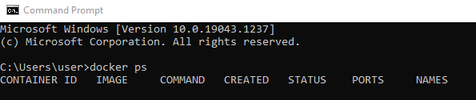
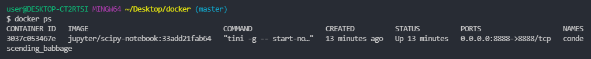
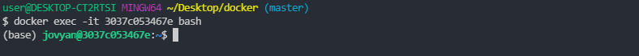
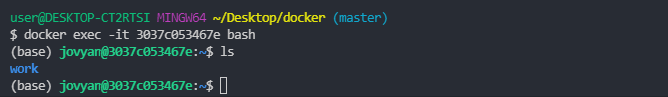
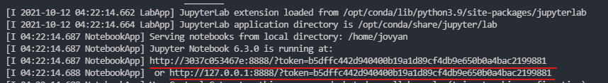
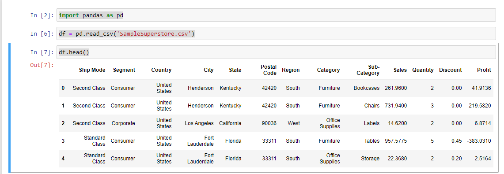

```all the commands are running from git bash```

# What is the docker in simple words?

It is virtual entity, cerated to solve specific tasks. This is not a full-fledges virtual system such as Virtual Box. It is just a cut version of the virtual machine which will serve only ,for example, Jupyter notebooks. What's great about docker? If you can install docker on your computer, you can launch any possible image. You can transfer it to other person to make sure you have same development environment with other person.

To check if docker is running, type in the terminal

```cmd
docker ps
```

Above commands outputs all of the containers which are launched right now.



If you see just a header shown above - that's fine. It means you have installed docker correctly, just no containers are running right now.

## Launching your first container

Many companies have their repository in docker which they constantly update: Jupyter, Postgres.

To launch Jupyter notebooks in the docker, we need to find the correct docker cli command. We can find it on the [Jupyter's "Read the docks" page](https://jupyter-docker-stacks.readthedocs.io/en/latest/).

Launch the following command in the terminal

```cmd
docker run -p 8888:8888 jupyter/scipy-notebook:33add21fab64
```
The following explanation was found on the same [web-site](https://jupyter-docker-stacks.readthedocs.io/en/latest/) as the above command.

> This command pulls the ```jupyter/scipy-notebook``` image tagged ```33add21fab64``` from Docker Hub if it is not already present on the local host. It then starts a container running a Jupyter Notebook server and exposes the server on host port ```8888```. The server logs appear in the terminal. Visiting ```http://<hostname>:8888/?token=<token>``` in a browser loads the Jupyter Notebook dashboard page, where hostname is the name of the computer running docker and token is the secret token printed in the console. The container remains intact for restart after the notebook server exits.

# How to get in your container 

While your container is running, open second terminal and enter the followng commnand:

```cmd
docker ps
```
You should see the following:



Copy **container id**, you will need it on the next step.

What if i want to get into my container. For example, to install libraries to work with data, databases.

You need to enter in the second terminal(if you closed it after the previous command, just open the new one):

```cmd
docker exec -it <mycontainer> bash
```

```<mycontainer>``` is you ***container id***

The terminal should output something similar:



Let's see what we have here:

```cmd
ls
```
Looks like just a folder **work** so far.



As well we can check if Python is installed on it:

```cmd
python
```

It should be pre-installed in yoru container.

# How to copy files into the container

We will copy **csv** file to our container.
The copy command is described in the [official documentation](https://docs.docker.com/engine/reference/commandline/cp/) and discussed in [Stakoverflow question](https://stackoverflow.com/questions/22907231/how-to-copy-files-from-host-to-docker-container)

Download the [file](./files/SampleSuperstore.csv) to your computer.

The general format of the *copy* command is:

```cmd
docker cp foo.txt <container_id>:/foo.txt
```

The first *foo.txt* is the path of the locaiton of the file on your computer (the one you have downloaded above). The second *foo.txt* is the future path to the copied file in the container.


To check the location where you are once you launch the container, type in the following command from inside of the docker:

```cmd
pwd
``` 
Most likely the reponse will be ```/home/jovyan```. 
We will use this path as a prefix for the future location of the file we would like to copy into our container.

The full path will be teh following ```/home/jovyan/SampleSuperstore.csv```

We are ready to copy the file. 
The following command should be entered from teh terminal of you local machine. NOT from inside of the container. You may need to open a new terminal.

```cmd
docker cp ./files/SampleSuperstore.csv <container_id>:/home/jovyan/files/SampleSuperstore.csv
```

Now check if file has beedn copied. Write the command inside of the container:

Let's see what we have here:

```cmd
ls
```

You should see ```SampleSuperstore.csv``` there:


If you have not tried before, try to check if Jupyter notebook in container works and loads the data.

In the terminal where you've launched the container, click on one of 2 links under the wording **Jupyter Notebook is running at:**



Then create the notebook and enter the following code:

```python
import pandas as pd
df = pd.read_csv('SampleSuperstore.csv')
df.head()
```
If you see the following output, everything works well:




# Connecting Volume

## **Issue:**
 Now what if we want to copy the data back to our local machine after we worked on it in the Jupyter notebook in the container. By analogy with the previous task we can copy the file from the container from the container to the local machine.

There is a special *docker cli* command:

```cmd
docker cp <container_id>:/foo.txt foo.txt
```

However if we have more files/notebooks, our project can get pretty big, what to do in that case. Copying manually files seems unefficient.


## **Solution:**

There is such thing in docker as **volume**. It works as such you connect hard drive to the container. Such "hard drive" can be just a folder on our local machine. This folder will be visible and on the local machine and in the container.

In the terminal get into the folder/directory you want to mount the volumes to and get the path by:

```cmd
pwd
``` 

Decide which directory in your container shoudl be connected to your folder on local machine. I have chosen ```/home/jovyan/```

Then enter the command which launches the container and attaches **volume** to it.

```cmd
docker run -v <path to your folder on the local computer>:/home/jovyan/ -p 8888:8888 jupyter/scipy-notebook:33add21fab64
``` 

The previous command actually did not work on my machine. I have Windows 10 and git bash as a terminal.

I found a stackoverflow [question](https://stackoverflow.com/questions/50608301/docker-mounted-volume-adds-c-to-end-of-windows-path-when-translating-from-linux) that remedies my issue.

The new command will be the following:

```cmd
docker run -v /${PWD}:/home/jovyan/ -p 8888:8888 jupyter/scipy-notebook:33add21fab64
```

Voila!


# How to run terminal commands automatically at the launch

Why this is important? 

For example you are launching Jupyter notebook contaienr and want specific libraries be pre-installed.

Originally we launched the container ```scipy-notebook:33add21fab64```. This container was not created from the scratch, per se. It was created by somebody else, realeased on docker marketplace and we are just launching it on our machine.

What's cool about docker, we can borrow someone's image(base image), for example, ```scipy-notebook:33add21fab64```, and tune it up to fit our needs.

We tune up the image(base image) with the **dockerfile** helper file. This file contains the description on the logic of your container.

Create in the folder, where you have been launching the image from, the file named **Dockerfile** and insert the following code inside of it.

```docker
FROM jupyter/scipy-notebook:33add21fab64

RUN pip install pandas
```

*Run* command above will be launched in the terminal in the container once the container is launched.

Now, how we would launch the docker after we have created the docker file?


First, we need to enter in the terminal the command:

```cmd
docker build .
```

The dot(.) in the code above is the location of the *dockerfile*.

What we need from log/output on the screen is the container id. You can find it either:
- after the words " => => writing image"
- after the words "successfullu buit"

Previously we launched the container with

```cmd
docker run -v /${PWD}:/home/jovyan/ -p 8888:8888 jupyter/scipy-notebook:33add21fab64
```

We need to modify the command above and insert the container id we got above insted of the base image name.

```cmd
docker run -v /${PWD}:/home/jovyan/ -p 8888:8888 <container id>
```

# Docker Compose

Why we might need it? To launch several services at the same time. In stead of bulky docker cli commands we will utilize configuration file with much simplier syntaxis.

Create **docker-compose.yml** file in the folder from which you launch your conatiner.

Fill in the docker compose file the following way.
```yml
version: "3.1"
services:
  jupyter:
    build:
      context: ./
      dockerfile: Dockerfile
    volumes:
      - ./:/home/jovyan/
    ports:
      - 8888:8888
```

*Context* above is the location of dockerfile.

To launch the container:

```cmd
docker-compose up
```

# Launch postgress along with Jupyter


From now on adding containers becomes much easier task, since we have started using docker-compose.

Modify the **docker-compose.yml** file to include db:

```yml
version: "3.1"
services:
  jupyter:
    build:
      context: ./
      dockerfile: Dockerfile
    volumes:
      - ./:/home/jovyan/
    ports:
      - 8888:8888
  db:
    image: postgres:latest
    restart: always
    environment:
      POSTGRES_USER: postgres
      POSTGRES_PASSWORD: postgres
      POSTGRES_DB: postgres
    ports:
      - 5432:5432
```

As well modify the **Dockerfile** to include new library ```psycopg2```:

```
FROM jupyter/scipy-notebook:33add21fab64

RUN pip3 install pandas psycopg2     

```


To launch the container:

```cmd
docker-compose up --build
```


Open/create the notebook in your container and enter and execute the following script:

```python
import psycopg2
conn = psycopg2.connect("host=db dbname=postgres user=postgres password=postgres")
```

If no errors - cool, let's continue!

# Load Data to DB

Stackoverflow [question](https://stackoverflow.com/questions/2987433/how-to-import-csv-file-data-into-a-postgresql-table) is helping as usual.

There are two methods. We will use the option which employs ```sqlalchemy library```.

Open/create the notebook in your container and enter and execute the following script:

```python
from sqlalchemy import create_engine
engine = create_engine('postgresql://postgres:postgres@db:5432/postgres')

df.to_sql('superstoredata', engine)

df_pg = pd.read_sql_query('Select * from superstoredata', con=engine)

df_pg.head()

```

# Add Volume to save DB data permanently on disk

if your containers have been runnning:

To stop containers from running
```cmd
docker-compose stop
```

To delete containers
```cmd
docker-compose stop
```

Adjust the *docker-compose.yml*:

```yml
version: "3.1"
services:
  jupyter:
    build:
      context: ./
      dockerfile: Dockerfile
    volumes:
      - ./:/home/jovyan/
    ports:
      - 8888:8888
  db:
    image: postgres:latest
    restart: always
    environment:
      POSTGRES_USER: postgres
      POSTGRES_PASSWORD: postgres
      POSTGRES_DB: postgres
    volumes:
      - pgdata:/var/lib/postgresql/data
    ports:
      - 5432:5432
volumes:
  pgdata:
```

Now run:

```cmd
docker-compose up --build
```

Execute all of your python scripts that write data to the database.

Again, to stop containers from running
```cmd
docker-compose stop
```

To delete containers
```cmd
docker-compose down
```

Type in command to check existing volumes on your local machine:

```cmd
docker volume ls
```

You should see  ```docker_pgdata```.

Theoretically we can backup our database and have it as a file and open it in DBeaver.

To remove volume from your local machine:

```cmd
docker volume rm <volume name>
```
